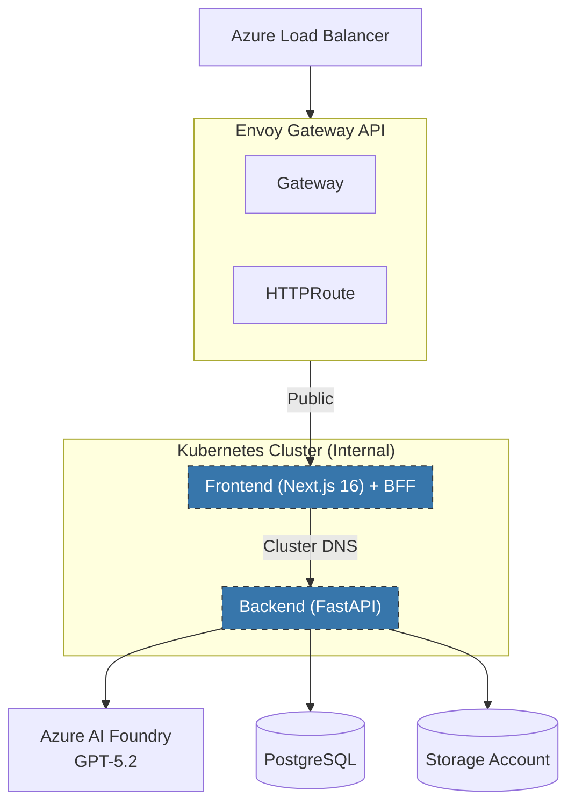

# Azure AI Chat Application

> **⚠️ Warning:** This repository is **vibe-coded with AI**. Code has been generated and iterated on using AI assistants. Review thoroughly before using in production.

A  Azure OpenAI application with **GPT-5.2** streaming chat and visible thinking process, built on Azure Kubernetes Service (AKS) with Azure AI Foundry.

## 🚀 Features

- **GPT-5.2 Streaming**: Real-time streaming responses with visible reasoning steps
- **Thinking Process Visualization**: See how GPT-5.2 thinks step-by-step
- **Backend-for-Frontend (BFF)**: Secure architecture with internal-only backend API
- **Next.js 16**: Modern frontend with Turbopack for blazing-fast builds
- **FastAPI + LangGraph**: High-performance backend with AI workflow orchestration
- **Azure AI Foundry**: Unified AI platform for model management and deployment
- **Envoy Gateway API**: Modern Kubernetes-native traffic management
- **Terraform Workspaces**: Infrastructure as Code for multiple environments
- **Helm Charts**: Kubernetes deployment automation

## 📋 Architecture



## 🏗️ Tech Stack

### Frontend
- **Next.js 16** with App Router & Turbopack
- **React 19.2** with React Compiler
- **TypeScript 5.6+**
- **Tailwind CSS 4**
- **Shadcn/UI** components
- **TanStack Query** for data fetching
- **Server-Sent Events (SSE)** for streaming

### Backend
- **Python 3.12+**
- **FastAPI** for REST API
- **LangGraph** for AI workflows
- **Azure AI Foundry SDK** for unified AI services
- **Azure OpenAI SDK** (GPT-5.2)
- **Pydantic v2** for data validation
- **OpenTelemetry** for distributed tracing

### Infrastructure
- **Azure Kubernetes Service (AKS)**
- **Azure AI Foundry** (Hub & Projects)
- **Azure OpenAI Service** (GPT-5.2)
- **Azure AI Search** (Vector search)
- **Azure Cosmos DB** (NoSQL)
- **Azure Container Registry**
- **Azure Key Vault**
- **Application Insights**
- **Envoy Gateway API**

### DevOps
- **Terraform** with Workspaces
- **Helm 3** for Kubernetes deployments
- **GitHub Actions** for CI/CD
- **Docker** for containerization

## 📦 Project Structure

```
aks-ai-app/
├── infra/
│   ├── terraform/           # Infrastructure as Code
│   │   ├── modules/         # Reusable Terraform modules
│   │   └── environments/    # Environment-specific tfvars
│   └── helm/               # Helm charts
│       └── ai-app/         # Main application chart
├── backend/                # Python FastAPI application
│   ├── app/
│   │   ├── api/           # API endpoints
│   │   ├── services/      # Azure AI integrations
│   │   ├── graphs/        # LangGraph workflows
│   │   └── models/        # Pydantic models
│   └── tests/             # Backend tests
├── frontend/              # Next.js 16 application
│   └── src/
│       ├── app/          # App Router pages
│       ├── components/   # React components
│       ├── hooks/        # Custom hooks
│       └── lib/          # Utilities
├── docs/                 # Documentation
└── scripts/              # Automation scripts
```

## 🚦 Quick Start

### Prerequisites

- **Azure Subscription** with appropriate permissions
- **Azure CLI** (`az` command)
- **Terraform** >= 1.8.0
- **Helm** >= 3.14.0
- **kubectl** >= 1.29.0
- **Node.js** >= 20.0.0
- **Python** >= 3.12
- **Docker** >= 24.0.0

### 1. Clone Repository

```bash
git clone <repository-url>
cd aks-ai-app-sample
```

### 2. Configure Environment

```bash
# Copy environment template
cp .env.example .env

# Edit .env with your Azure credentials and endpoints
nano .env
```

### 3. Deploy Infrastructure (Dev Environment)

```bash
# Navigate to Terraform directory
cd infra/terraform

# Initialize Terraform
terraform init

# Create/select dev workspace
terraform workspace new dev
# or
terraform workspace select dev

# Plan infrastructure
terraform plan -var-file="environments/dev.tfvars"

# Apply infrastructure
terraform apply -var-file="environments/dev.tfvars"

# Save outputs
terraform output -json > outputs.json
```

### 4. Install Envoy Gateway

```bash
# Install Gateway API CRDs
kubectl apply -f https://github.com/kubernetes-sigs/gateway-api/releases/download/v1.0.0/standard-install.yaml

# Install Envoy Gateway
helm install eg oci://docker.io/envoyproxy/gateway-helm \
  --version v1.0.0 \
  -n envoy-gateway-system \
  --create-namespace

# Verify installation
kubectl get pods -n envoy-gateway-system
```

### 5. Deploy Application with Helm

```bash
cd infra/helm

# Install application (dev environment)
helm install ai-app ./ai-app \
  -f ./ai-app/values-dev.yaml \
  --namespace dev \
  --create-namespace

# Check deployment status
kubectl get pods -n dev
kubectl get gateway -n dev
kubectl get httproute -n dev
```

### 6. Local Development

#### Backend

```bash
cd backend

# Create virtual environment
python -m venv venv
source venv/bin/activate  # Windows: venv\Scripts\activate

# Install dependencies
pip install -r requirements.txt
pip install -r requirements-dev.txt

# Run development server
uvicorn app.main:app --reload --host 0.0.0.0 --port 8000
```

#### Frontend

```bash
cd frontend

# Install dependencies
npm install

# Run development server with Turbopack
npm run dev

# Open browser at http://localhost:3000
```

### 7. Access Application

```bash
# Get Gateway IP address
kubectl get gateway ai-app-gateway -n dev -o jsonpath='{.status.addresses[0].value}'

# Access application (frontend only - backend is internal)
# Frontend: http://<gateway-ip>
# API calls are proxied through frontend to internal backend service
```

## 🔧 Configuration

### Terraform Workspaces

The project uses Terraform workspaces for environment management:

- **dev** - Development environment
- **sit** - System Integration Testing
- **uat** - User Acceptance Testing
- **production** - Production environment

Switch between environments:

```bash
terraform workspace select <environment>
terraform plan -var-file="environments/<environment>.tfvars"
terraform apply -var-file="environments/<environment>.tfvars"
```

### Environment Variables

Key environment variables (see `.env.example` for complete list):

- `AZURE_OPENAI_MODEL=gpt-5.2` - GPT-5.2 model
- `ENABLE_STREAMING=true` - Enable streaming responses
- `ENABLE_THINKING_PROCESS=true` - Show thinking steps
- `NEXT_PUBLIC_ENABLE_THINKING_DISPLAY=true` - Frontend thinking UI

## 🧪 Testing

### Backend Tests

```bash
cd backend
pytest tests/ -v
pytest tests/unit/ -v
pytest tests/integration/ -v
```

### Frontend Tests

```bash
cd frontend
npm test
npm run test:e2e
```

## 📖 Documentation

- [Architecture Overview](docs/architecture.md)
- [Azure AI Foundry Setup](docs/azure-foundry-setup.md)
- [Terraform Workspaces Guide](docs/terraform-workspaces.md)
- [Helm Deployment](docs/helm-deployment.md)
- [Envoy Gateway Configuration](docs/envoy-gateway-setup.md)
- [GPT-5.2 Integration](docs/gpt52-integration.md)
- [Development Guide](docs/development.md)
- [API Documentation](docs/api-documentation.md)

## 🚀 Deployment

### CI/CD Pipeline

GitHub Actions workflows automatically:

1. Run tests on pull requests
2. Plan Terraform changes
3. Build and push Docker images
4. Deploy to AKS via Helm

See `.github/workflows/` for pipeline definitions.

### Manual Deployment

```bash
# Build and push images
cd backend
docker build -t <acr-name>.azurecr.io/backend:latest .
docker push <acr-name>.azurecr.io/backend:latest

cd ../frontend
docker build -t <acr-name>.azurecr.io/frontend:latest .
docker push <acr-name>.azurecr.io/frontend:latest

# Upgrade Helm release
helm upgrade ai-app ./infra/helm/ai-app \
  -f ./infra/helm/ai-app/values-production.yaml \
  --namespace production
```

## 🔐 Security

- **Backend-for-Frontend (BFF) Pattern** - Backend API is internal-only, never exposed to internet
- **Managed Identity** for Azure service authentication
- **Key Vault** for secrets management
- **Private Endpoints** for network isolation
- **Network Policies** - Backend only accepts traffic from frontend pods
- **RBAC** for fine-grained access control
- **Content Safety** for AI response filtering
- **Rate Limiting** via Envoy Gateway policies

## 📊 Monitoring

- **Application Insights** - Application telemetry
- **Azure Monitor** - Infrastructure metrics
- **Prometheus** - Kubernetes metrics
- **Grafana** - Visualization dashboards
- **Distributed Tracing** - Request flow tracking

## 🤝 Contributing

1. Fork the repository
2. Create a feature branch
3. Commit your changes
4. Push to the branch
5. Create a Pull Request

## 📝 License

[Your License]

## 🆘 Support

For issues and questions:
- GitHub Issues: [Repository Issues]
- Documentation: [docs/](docs/)

## 🎯 Roadmap

- [ ] Multi-modal support (images, audio)
- [ ] Advanced RAG with hybrid search
- [ ] Multi-agent orchestration
- [ ] Fine-tuned GPT-5.2 models
- [ ] Voice chat integration
- [ ] Mobile application

---

**Built with ❤️ using Azure AI Foundry, GPT-5.2, Next.js 16, and FastAPI**
